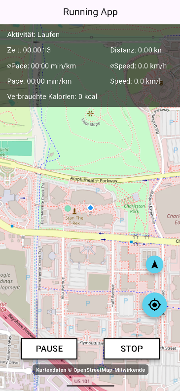

# Running App in Flutter
## Kompatibel mit Android und IOS

## Autoren: Max Purath, Leo Smolik

## Funktionalität
- verschiedene Aktivitäten (Laufen, Gehen und Rad Fahren) können getrackt werden
- die zurückgelegte Route wird auf einer OSM-Hintergrundkarte angezeigt
- Paramater wie die Distanz, Zeit, Pace, Geschwindigkeit, aktuelle Pace und Geschwidigkeit sowie verbrauchte Kalorien werden berechnet
- Lauf kann pausiert werden

  